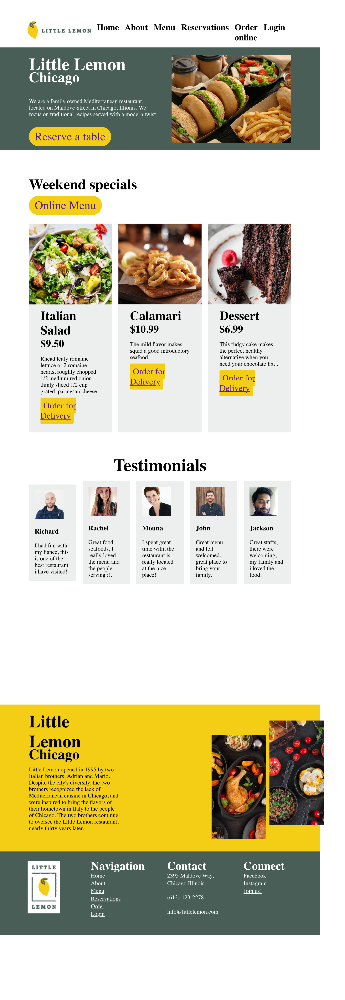
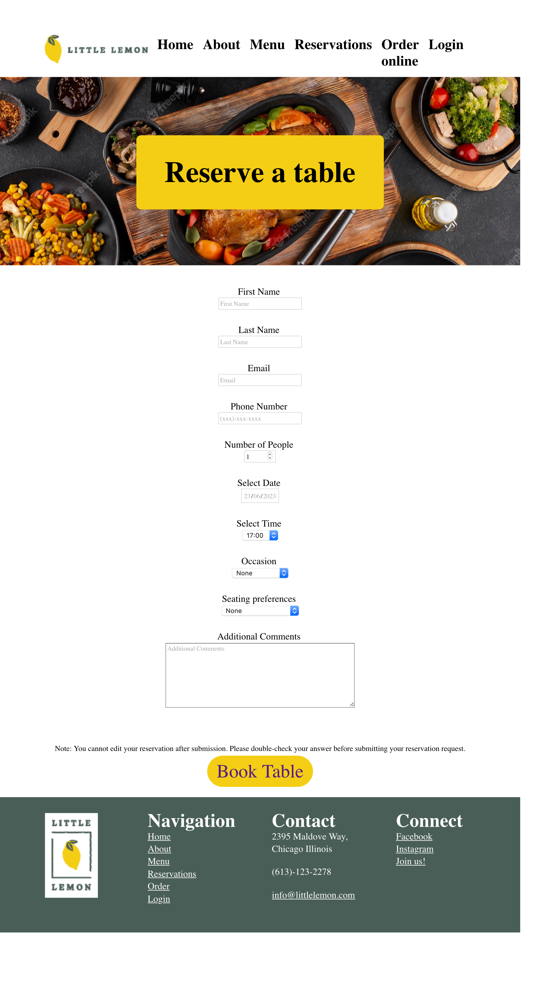

# Little lemon restaurant
This is my Final capstone project for Meta Front-end developer program on Coursera, which contains a detailed and responsive website with table-booking functionality built using React.

## Screenshots

### Home Page

### Booking Page

### Tech languages:

- HTML, CSS
- JSX
- React

### Third Party Libraries & APIs:

- react-router-dom
- react-responsive-carousel
- Meta front-end table-booking API

### Author

- [Rocien Nkunga](https://github.com/Rocien)